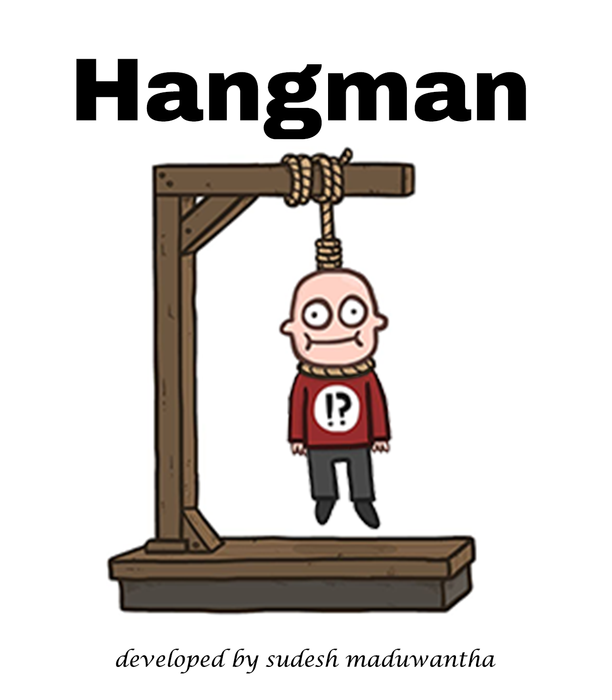

# Hangman Game
  

## Description
This is a Hangman game implemented using Python and Flask. The game includes features such as hints, time limits, and scoring.

## Features
- Play Hangman with a time limit of 60 seconds per word.
- Hints are available for each word.
- Score tracking and background color changes based on game status.

## Installation
1. Clone the repository:
   ```bash
   git clone https://github.com/SudeshMaduwantha/Hangman.git

2. Navigate to the project directory:
    cd Hangman

3. Install the required dependencies:
    pip install -r requirements.txt

## Usage

# Start the Flask application:
    python app.py

# Open your browser and navigate to http://localhost:5000.

# Developed by Sudesh Maduwantha Kumarasiri